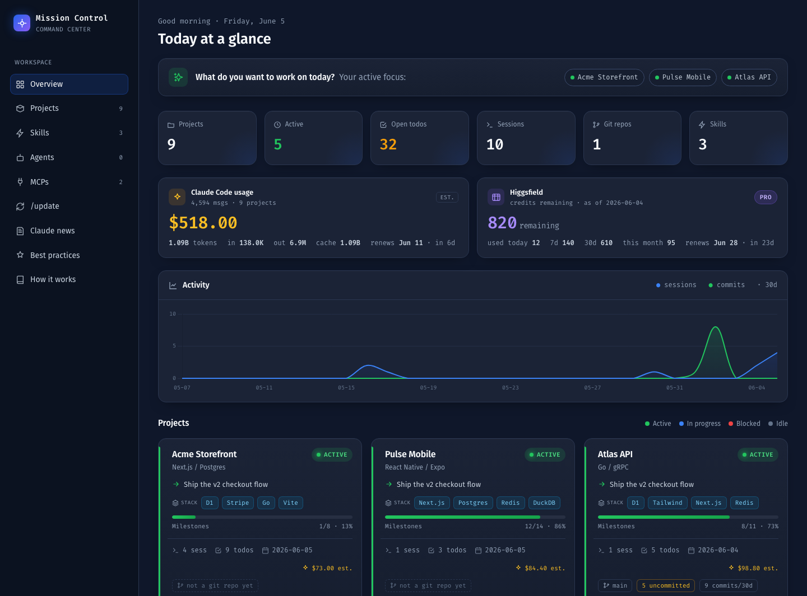

# Mission Control

### One dashboard for every Claude Code project you run, plus a memory that lets Claude pick up exactly where you left off.



> The screenshot uses demo data. Your dashboard shows your real projects.

Claude Code is sharp inside a session and forgets everything the moment it ends. And once you're juggling more than one project, it's hard to remember what's where, what's blocked, and what's next. **Mission Control fixes both** — locally, with no server, no build step, and nothing to `pip install`. A small Python script reads your project folders, your Claude sessions, and git; a fast, dark dashboard shows you the whole picture.

**Highlights**

- 🗂️ **Every project on one screen** — status, next action, milestones, todos, activity, and spend
- 🧠 **Persistent memory** — Claude starts each session already knowing your project
- 📓 **Session journal** — history accumulates automatically, written with one `/update`
- 🏗️ **Living architecture docs** — an interactive diagram and tech spec per project
- 💸 **Usage & spend** — estimated Claude cost plus optional Higgsfield credits
- 🔒 **Local & private** — no server, no build, just plain markdown you own

---

## ✦ Manage your whole portfolio at a glance

Every project you have, on one screen, ranked by what needs attention.

- **A live command center** — status, the single next action, milestone progress, and open todos for each project, with active work surfaced first.
- **Real activity, not guesses** — sessions and git commits over the last 30 days, last-active dates, branch and dirty-state, all read straight from disk.
- **Usage & spend** — an estimated Claude Code cost from your session logs, optional Higgsfield credits with auto-derived renewal dates, and a per-project cost chip. Know what each project is costing you.
- **Drill into any project** — milestones, todos, an interactive architecture diagram, the file tree, and Claude usage on a dedicated page.
- **Your skills, agents & MCPs** — see the shared Claude Code skills, agents, and connected MCP servers powering your work.

One folder per project. Add a tiny `mission-control.md` note and the dashboard does the rest. No note? It still shows everything it can derive.

## ✦ Give every project a memory

This is the part Claude Code is missing. Mission Control gives each project a **knowledge base that travels with the code** and feeds straight back into your next session.

- **A session journal** — every time you finish working, `/update` appends a dated entry: what happened, what you decided, what's next. The story of the project accumulates instead of vanishing.
- **Auto-loaded context** — a small, stable digest (status, next action, recent history) is wired into each project's `CLAUDE.md`, so **every new session starts already knowing where things stand.** No re-explaining. No "let me re-read the codebase."
- **Smarter and cheaper** — because Claude resumes from a compact digest instead of re-deriving context, you skip the expensive re-discovery and keep the prompt cache warm.
- **Living architecture docs** — a per-project tech spec and an always-on architecture brief, kept current with one command, so the system's shape is never a mystery.
- **Plain markdown, yours forever** — it's just files in a `knowledge/` folder. Commit it, diff it, or open the whole thing as an [Obsidian](https://obsidian.md) vault. No lock-in.

The result: close a session without fear. Your memory now lives in the repo, so tomorrow's session, or a teammate's, starts informed.

---

## Quick start

Mission Control lives **next to your projects**, under one parent folder. Clone it in and run one script:

```bash
cd ~/Startups                        # the folder that holds all your projects
git clone <repo-url> mission-control
cd mission-control
./setup.sh                           # installs the commands + builds the dashboard
open index.html                      # done
```

`setup.sh` is idempotent — re-run it after a `git pull`. That's the whole install.

> No `~/Startups`? Clone wherever your projects live. The projects root is auto-detected as the folder containing this checkout (override with `MC_ROOT=/path ./setup.sh`).

## One command keeps it all current

`setup.sh` installs four slash commands you run inside any Claude Code session:

| Command | What it refreshes |
|---|---|
| **`/update`** | the project's status note, and appends a journal entry (run this at the end of a session) |
| `/update-arch` | the architecture: diagram + `CLAUDE.md` brief + deep spec |
| `/update-usage` | Higgsfield credit usage |
| `/update-news` | the built-in Claude news feed |

Each one regenerates the dashboard for you. The only one you need as a habit is **`/update`** when you wrap up.

## How a project is tracked

Drop an optional `mission-control.md` into any project folder:

```yaml
---
name: My Project
status: active          # active | in-progress | blocked | idle | archived
stack: Next.js / Postgres
next: Ship the checkout flow
milestones:
  - [x] Auth
  - [ ] Billing
todos:
  - Wire the webhook
---
One paragraph on where things stand.
```

Every field is optional and degrades gracefully. A project with no note still shows derived data (sessions, git, last active).

## What's under the hood

```
your-projects/*  ──►  generate.py  ──►  data.js  ──►  index.html · project.html
(real folders +       (stdlib + git)    (snapshot)    (open via file://)
 ~/.claude sessions)
```

No server, no database, no build. A standard-library Python scanner writes a single `data.js`; static HTML renders it. It's fast, hackable, and entirely yours.

## Requirements

- **Python 3** — standard library only, nothing to install.
- **git** — optional, powers the repository panels.
- A modern browser to open the HTML.

## Learn more

Open **`guide.html`** for the full walkthrough (architecture, folder structure, the daily workflow, the knowledge base, and Obsidian setup). The dashboard sidebar also links a **Best Practices** page and a **Claude News** feed.

## License

MIT © 2026 Neaam Hariri — see [`LICENSE`](LICENSE).
