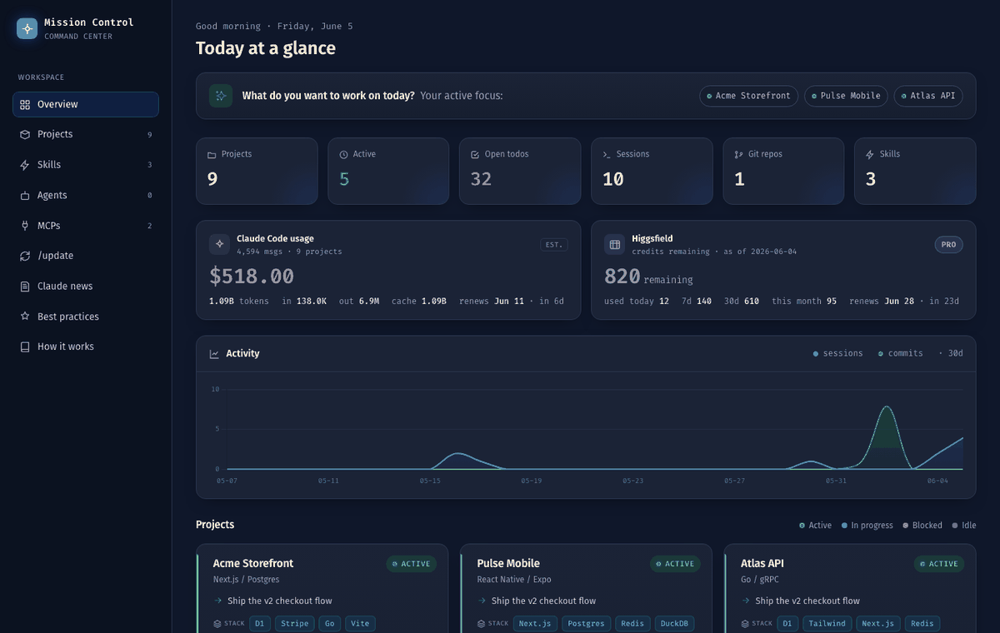

# Mission Control

### Claude gave you an ideas explosion. Mission Control helps you actually finish them.

*For developers whose Claude Code usage turned into 5+ half-built projects — and who want their focus back.*


> The screenshot uses demo data. Your dashboard shows your real projects.

Claude is so good at building that ideas turn into projects faster than you can finish them. A month in, you're juggling five repos and losing the thread on all of them. The bottleneck isn't coding anymore — it's **focus**. Mission Control is the command center that puts every project on one screen (what's active, what's blocked, what's next) and gives each one a memory so you can drop in and pick up instantly. Less context-switching tax. Fewer abandoned repos. It runs locally, with no server, no build step, and nothing to `pip install`.

**Highlights**

- 🗂️ **Every project on one screen** — beat the sprawl; see what actually needs you, ranked by attention
- 🎯 **Focus** — status, the single next action, what's blocked, and open todos for each project
- 🧠 **Per-project memory** — drop into any project and resume instantly, no re-explaining
- 📓 **Auto session journal** — your project's history accumulates, written with one `/update`
- 🏗️ **Living architecture docs** — an interactive diagram and tech spec per project
- 💸 **Usage & spend** — estimated Claude cost plus optional Higgsfield credits
- 🔒 **Local & private** — no server, no build, just plain markdown you own

---

## ✦ Beat the sprawl — every project on one screen

The moment you have more than two or three projects, you start losing track. Mission Control gives you the one view that AI-speed building takes away: **all of it, ranked by what needs you.**

- **A live command center** — status, the single next action, milestone progress, and open todos for each project, with active work surfaced first so you know exactly where to spend today.
- **Spot what's stalling** — blocked and idle projects don't quietly rot; they're flagged. See the abandoned repo before it's abandoned.
- **Real activity, not vibes** — sessions and git commits over the last 30 days, last-active dates, branch and dirty-state, all read straight from disk.
- **Usage & spend** — an estimated Claude Code cost from your session logs, optional Higgsfield credits with auto-derived renewal dates, and a per-project cost chip.
- **Drill into any project** — milestones, todos, an interactive architecture diagram, the file tree, and Claude usage on a dedicated page.

One folder per project. Add a tiny `mission-control.md` note and the dashboard does the rest. No note? It still shows everything it can derive.

## ✦ Drop in and resume instantly

Switching between five projects is brutal when each restart means re-explaining everything to Claude. Mission Control gives each project a **memory that travels with the code** and feeds straight back into your next session, so context-switching stops costing you.

- **A session journal** — every time you finish working, `/update` appends a dated entry: what happened, what you decided, what's next. The story of the project accumulates instead of vanishing.
- **Auto-loaded context** — a small, stable digest (status, next action, recent history) is wired into each project's `CLAUDE.md`, so **every new session starts already knowing where things stand.** No re-explaining. No "let me re-read the codebase."
- **Cheaper, too** — because Claude resumes from a compact digest instead of re-deriving context, you skip the expensive re-discovery and keep the prompt cache warm.
- **Plain markdown, yours forever** — it's just files in a `knowledge/` folder. Commit it, diff it, or open the whole thing as an [Obsidian](https://obsidian.md) vault. No lock-in.

The result: close a session without fear, jump to a different project, and pick the first one back up cold. Your memory now lives in the repo.

## ✦ Stay sharp on Claude itself

Mission Control ships with built-in reference pages, so the latest from Anthropic and the habits that make you faster are always one click away in the dashboard sidebar.

- **📰 Claude News** — a curated feed of the newest Claude model and product releases, an events calendar (Anthropic's *Code with Claude* and more, with upcoming dates highlighted), and free tutorials from Anthropic Academy. Refresh the whole feed in one step with `/update-news`.
- **⚡ Best Practices** — a living cheat-sheet of the skills and slash commands in your toolkit, *when* to reach for each, and the session habits that cut your token spend and lift answer quality.
- **🛠️ Your skills, agents & MCPs** — the dashboard surfaces the Claude Code skills, agents, and connected MCP servers you have available, so your whole toolkit is visible at a glance.
- **📖 Built-in guide** — how Mission Control works end to end, how to set it up in your own environment, and how to open your knowledge base as an Obsidian vault.

Every page is plain static HTML, themed to match, and works fully offline.

## See it in action



> A quick tour: the portfolio overview, the built-in Claude news feed, and the best-practices cheat-sheet (demo data).

---

## Quick start

Mission Control lives **next to your projects**, under one parent folder. Clone it in and run one script:

```bash
cd ~/Startups                        # the folder that holds all your projects
git clone <repo-url> mission-control
cd mission-control
./setup.sh                           # installs the commands + builds the dashboard
open index.html                      # done
```

`setup.sh` is idempotent — re-run it after a `git pull`. That's the whole install.

> No `~/Startups`? Clone wherever your projects live. The projects root is auto-detected as the folder containing this checkout (override with `MC_ROOT=/path ./setup.sh`).

## One command keeps it all current

`setup.sh` installs these slash commands you run inside any Claude Code session:

| Command | What it refreshes |
|---|---|
| **`/update`** | the project's status note, and appends a journal entry (run this at the end of a session) |
| `/update-arch` | the architecture: diagram + `CLAUDE.md` brief + deep spec |
| `/update-usage` | Higgsfield credit usage |
| `/update-news` | the built-in Claude news feed |
| `/archive` | sets a project's status to archived (keeps its history; drops it from the active standup) |

Each one regenerates the dashboard for you. The only one you need as a habit is **`/update`** when you wrap up.

## How a project is tracked

Drop an optional `mission-control.md` into any project folder:

```yaml
---
name: My Project
status: active          # active | in-progress | blocked | idle | archived
stack: Next.js / Postgres
next: Ship the checkout flow
milestones:
  - [x] Auth
  - [ ] Billing
todos:
  - Wire the webhook
---
One paragraph on where things stand.
```

Every field is optional and degrades gracefully. A project with no note still shows derived data (sessions, git, last active).

## What's under the hood

```
your-projects/*  ──►  generate.py  ──►  data.js  ──►  index.html · project.html
(real folders +       (stdlib + git)    (snapshot)    (open via file://)
 ~/.claude sessions)
```

No server, no database, no build. A standard-library Python scanner writes a single `data.js`; static HTML renders it. It's fast, hackable, and entirely yours.

## Requirements

- **Python 3** — standard library only, nothing to install.
- **git** — optional, powers the repository panels.
- A modern browser to open the HTML.

## Learn more

Open **`guide.html`** for the full walkthrough (architecture, folder structure, the daily workflow, the knowledge base, and Obsidian setup). The dashboard sidebar also links a **Best Practices** page and a **Claude News** feed.

## Contributing

PRs welcome, and the bar is low — no build tools, no dependencies, just clone and open it in a browser. See **[`CONTRIBUTING.md`](CONTRIBUTING.md)** for a five-minute dev setup, the one rule (stay zero-install), where things live, and good first issues.

## Author

Built by **[Neaam Hariri](https://github.com/NeaamHariri)** — after one month of Claude Code left me juggling five half-built projects with no way to see them all or remember where each one stood. Mission Control is how I got my focus back. If it does the same for you, a ⭐ on the repo means a lot and helps others find it.

## License

MIT © 2026 Neaam Hariri — see [`LICENSE`](LICENSE).
